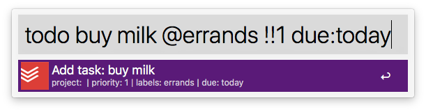
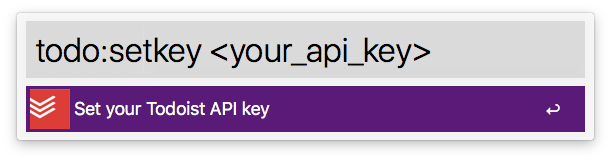
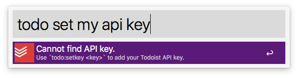

alfred-todoist
=============

An Alfred workflow for quickly adding tasks to Todoist.

With alfred-todoist you can quickly add a new task to Todoist from Alfred, using Todoist's own syntax. There is a feedback system heavily based on [alfred-workflow-todoist][1] which lets you know exactly what is being sent to Todoist.

alfred-todoist is written in python. Once installed, it just works. No need to install any extra software to get certain features to work. For a quick commands reference, see the [big list of examples][2]

To use alfred-todoist simply type `todo` and your task.

## alfred-todoist features:

* Add a task directly to a project (even if the project name contains spaces)
* Apply labels to the task
* Add a priority
* Add a due date
* Add one or more notes to the task

## Getting started
For alfred-todoist to be able to send tasks to Todoist, you must first give it [your api key][3]. This key will be securely stored in your keychain. If you use alfred-todoist on multiple computers, you will need to add the key on each computer.

To set the api key use: `todo:setkey <your_api_key>`

If you have not set your api key, alfred-todoist will not even attempt to parse the input, and will instead display a warning.

## Free form properties
Most task properties can be added in any order. Labels, priorities and projects can all parsed from anywhere because they have a defined syntax. However, due dates and notes are just a bunch of text. Because of this, due dates and notes must come _after_ the actual todo text.

**Right:**

	buy milk due: tomorrow note: 2% milk
	buy milk note: 2% milk due: tomorrow
	buy milk @errands due: tomorrow note: 2% milk
	@errands buy milk due: tomorrow note: 2% milk
	buy milk due: tomorrow note: 2% milk @errands

**Wrong**:

	due: tomorrow buy milk note: 2% milk
	note: 2% milk buy milk due: tomorrow
	due: tomorrow note: 2% milk buy milk @errands
	due: tomorrow note: 2% milk @errands buy milk

## Simple todo
The simplest use of alfred-todoist is adding a new task, with no properties to your inbox. In GTD terms, this is a fast way to "capture" an idea which can later be clarified/organized.

	todo buy milk
	todo hang shelves in the garage
	todo plan birthday party for mom

## Applying a label
Using Todoist's syntax of adding `@` to the beginning of a word, you can apply one or more labels to your task as well. Labels can go anywhere in the text. Currently, labels that don't already exist are ignored.

**Limitations** (on the roadmap to be fixed):

* Does not support Unicode.
* Only supports existing labels. Non-existent labels will be ignored.

<!-- breaker for syntax highlighting -->

	todo buy milk @grocery
	todo buy milk @errands @grocery
	todo @grocery buy milk

## Adding to a project
By default, new tasks are added to you inbox. To specify another project just use Todoist's syntax of prefixing the word with the pound sign (`#project`). Like labels, a project can be located anywhere in the text.

A unique feature of alfred-todoist is the ability to add to a project whose name contains spaces. To do that, simply wrap the project name with one of the following sets of characters:

* `''` single quotes
* `""` double quotes
* `` ` ` `` backticks
* `()` parenthesis
* `{}` curly brackets

<!-- breaker for syntax highlighting -->

	todo buy milk #shopping
	todo buy milk #{grocery shopping}
	todo #"grocery shopping" buy milk

## Adding a priority
alfred-todoist uses both the newer "double exclamation point then number" (`!!1`) and older "letter p then number" (`p1`) syntax for assigning priority. Priority can be located anywhere in the text. If no priority is provided, the task is considered a priority 4.

	todo buy milk !!1
	todo go window shopping !!3
	todo p1 buy milk immediately

## Assign a due date
You can assign a due date to your task by typing `due:`, then some text (make sure to note the colon at the end). Any text after that will be gathered and parsed by Todoist itself, so you can still take advantage of its natural language processing. Due to the free-form nature of Todoist's processing, `due:` _must_ come after the actual todo text. Otherwise, alfred-todoist will think it is part of the due date. A space after the colon is optional.

	todo buy milk due:tomorrow
	todo buy milk due: tomorrow
	todo thanksgiving dinner due: 4pm on 4th thursday in november
	todo due: 4pm on 4th thursday in november thanksgiving dinner [will not work]

## Add notes
Notes follow the same syntax rules as due date: A space after the colon is optional, and it must be located after the todo. Due dates and notes can be mixed in any order within themselves, but the todo must come before them. You can add as many separate notes as you want. To add a note, use the specifier `note:`

	todo buy milk note: 2% milk
	todo buy milk note:2% milk note:check the expiration date
	todo buy milk note: 2% milk due: tomorrow note:check the expiration date
	todo note:2% milk buy milk [will not work]

# List of Examples 
	pick up groceries
	pick up groceries !!1
	pick up groceries p1
	pick up groceries !!1 @errands
	pick up groceries @on_the_go
	pick up groceries !!1 @errands due:tomorrow note:check the grocery list note:check it twice
	pick up groceries note: check the grocery list
	pick up groceries #groceries
	pick up groceries !!1 #groceries @errands due: tomorrow
	pick up groceries !!1 #groceries @errands due: next week
	pick up groceries !!1 #groceries @errands due: next week note: check the grocery list
	pick up groceries !!1 #groceries @errands due: tomorrow note: check the grocery list
	pick up groceries !!1 #groceries @errands note: check the grocery list
	pick up groceries #{grocery shopping} !!3 @errands @grocery
	pick up groceries #(grocery shopping) !!3 @errands @grocery
	pick up groceries #`grocery shopping` !!3 @errands @grocery
	pick up groceries #"grocery shopping" !!3 @errands @grocery
	pick up groceries #'grocery shopping' !!3 @errands @grocery
	pick up groceries #grocery_shopping !!3 @errands @grocery
	pick up groceries #grocery-shopping !!3 @errands @grocery
	pick up groceries #grocery_shopping2 !!3 @errands @grocery
	!!1 pick up groceries
	p1 pick up groceries
	#groceries pick up groceries
	!!1 @errands pick up groceries
	@on_the_go pick up groceries
	pick up groceries note: check the grocery list
	!!1 pick up groceries @errands due:tomorrow note:check the grocery list note:check it twice
	!!1 #groceries @errands pick up groceries due: tomorrow
	!!1 #groceries @errands pick up groceries due: next week
	!!1 #groceries @errands pick up groceries due: next week note: check the grocery list
	!!1 #groceries @errands pick up groceries due: tomorrow note: check the grocery list
	!!1 #groceries @errands pick up groceries note: check the grocery list

[1]: https://github.com/moranje/alfred-workflow-todoist
[2]: #biglistexamples
[3]: https://developer.todoist.com/sync/v7/#get-all-projects
